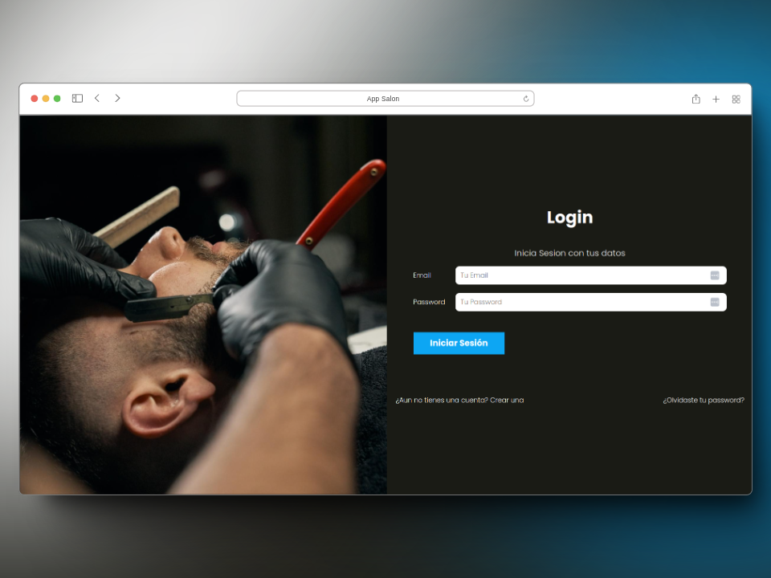
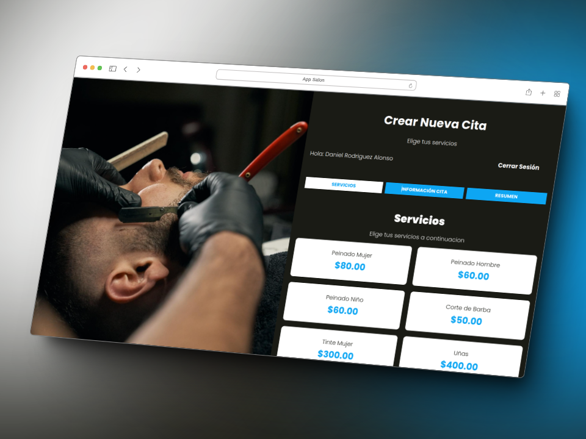
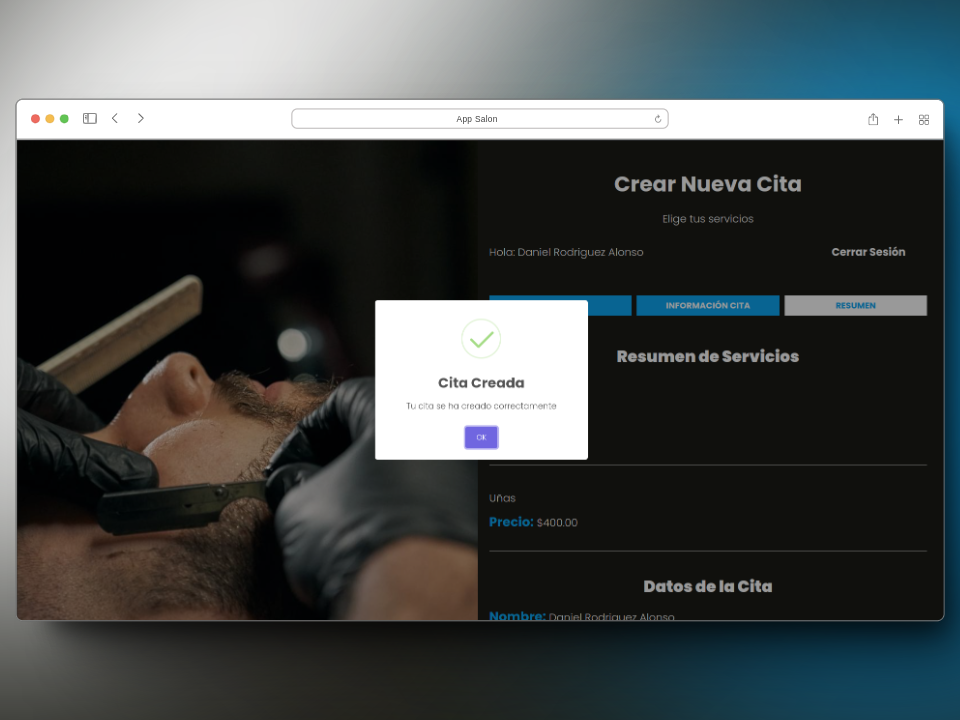
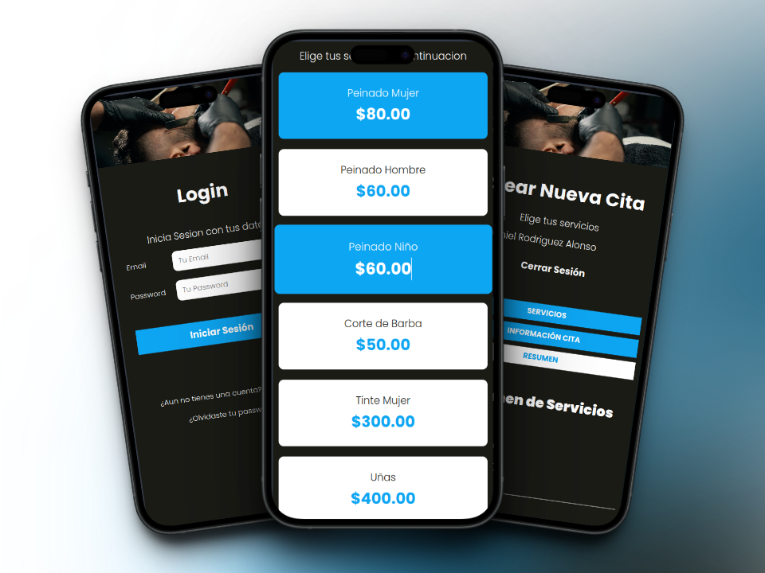

# App_Salon
Una aplicación para la gestión de citas en un salon de belleza/barberia, desarrollada con PHP, MySQL, JavaScript y SCSS 🚀

## Lanzamiento Local del Proyecto
Para ejecutar UpTask en tu entorno local, sigue estos pasos:

### Prerrequisitos
Asegúrate de que tengas instalados los siguientes componentes en tu máquina:

- [MySQL](https://www.adslzone.net/esenciales/windows-10/instalar-mysql/)
- [PHP](https://code.tutsplus.com/es/how-to-install-php-on-windows--cms-35435t)
- [Variables de entorno .env](https://www.mercenariophp.com/php-dotenv-variables-entorno/)

### Configuración de la Base de Datos
1. Inicia tu servidor MySQL.

2. En la raíz del proyecto, ejecuta el siguiente comando como usuario root para configurar la base de datos:

```bash
$ source sql/setup.sql
```

### Inicio del Servidor
1. Instala las dependencias de npm y composer
```bash
$ npm install
```
```bash
$ composer install
```
2. Abre una terminal y navega hasta la carpeta `public` del proyecto.

3. Ejecuta el siguiente comando para iniciar el servidor PHP en el puerto 8000:

```bash
$ php -S localhost:8000
```
## Acceso a la Aplicación
Una vez completados estos pasos, podrás acceder a UpTask en tu navegador a través de la siguiente dirección:
[http://localhost:8000](http://localhost:8000)

## Mokups de la aplicación

### Tamaño escritorio







### Tamaño movil


